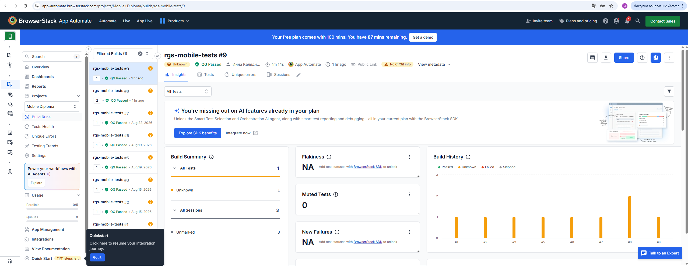
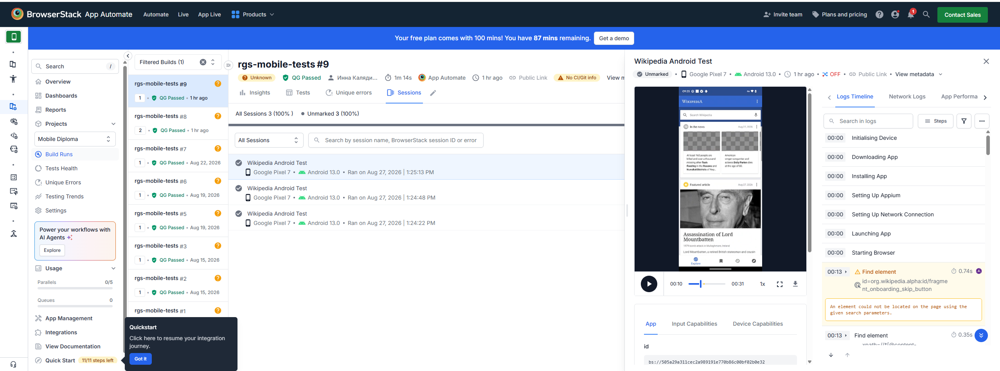
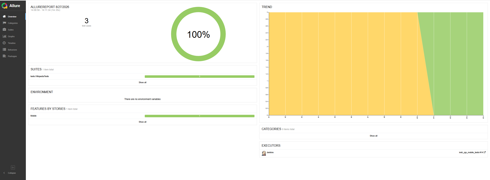

# Mobile UI Automation Project

Проект автоматизации мобильного тестирования Android-приложения **Wikipedia**.

Автотесты реализованы на Java с использованием **Appium** и **JUnit 5**.  
Проект поддерживает локальный и удалённый запуск мобильных тестов. Удалённое выполнение осуществляется на реальных Android-устройствах в **BrowserStack App Automate**.

Для CI используется **Jenkins**, результаты выполнения тестов формируются в **Allure Report**.

---

## Technology Stack

- Java 17
- JUnit 5
- Appium
- Selenium
- BrowserStack App Automate
- Owner
- Allure Report
- Gradle
- Jenkins
- Git
- GitHub

---

## Implemented Tests

В проекте реализованы следующие мобильные UI-тесты:

1. Открытие экрана поиска Wikipedia
2. Поиск статьи в Wikipedia
3. Открытие статьи из результатов поиска

Тесты используют Page Object подход: взаимодействие с мобильным интерфейсом вынесено в класс `WikipediaScreen`.

---

## Project Structure

```text
rgs-mobile-tests
├── images
│   ├── allure-report.png
│   ├── browserstack-build.png
│   ├── browserstack-session.png
│   └── mobile-test.mp4
│
├── src
│   └── test
│       ├── java
│       │   ├── config
│       │   │   ├── LocalMobileConfig.java
│       │   │   ├── MobileConfig.java
│       │   │   ├── MobileConfigReader.java
│       │   │   └── RemoteMobileConfig.java
│       │   │
│       │   ├── drivers
│       │   │   ├── BrowserstackDriver.java
│       │   │   └── LocalMobileDriver.java
│       │   │
│       │   ├── screens
│       │   │   └── WikipediaScreen.java
│       │   │
│       │   ├── tests
│       │   │   ├── TestBase.java
│       │   │   └── WikipediaTests.java
│       │   │
│       │   └── utils
│       │       └── Attach.java
│       │
│       └── resources
│           └── config
│               ├── browserstack.properties
│               └── local.properties
│
├── .gitignore
├── build.gradle
├── gradlew
└── gradlew.bat
```

---

## Configuration

Для работы с конфигурацией используется библиотека **Owner**.

Конфигурация разделена на локальный и удалённый запуск:

- `MobileConfig` — базовый интерфейс конфигурации;
- `LocalMobileConfig` — параметры локального запуска;
- `RemoteMobileConfig` — параметры BrowserStack;
- `MobileConfigReader` — выбор необходимой конфигурации.

Режим запуска определяется системным параметром:

```text
env
```

Удалённый запуск:

```bash
./gradlew clean test -Denv=remote
```

Локальный запуск:

```bash
./gradlew clean test -Denv=local
```

---

## BrowserStack

Удалённые мобильные тесты выполняются с использованием **BrowserStack App Automate**.

В текущей конфигурации тесты запускаются на:

```text
Device: Google Pixel 7
OS: Android 13.0
Platform: Android
Automation: UiAutomator2
```

Параметры удалённого устройства находятся в:

```text
src/test/resources/config/browserstack.properties
```

Пример:

```properties
device=Google Pixel 7
osVersion=13.0
app=bs://...
```

Для подключения к BrowserStack используются переменные окружения:

```text
BROWSERSTACK_USERNAME
BROWSERSTACK_ACCESS_KEY
```

Секретные данные не хранятся непосредственно в исходном коде проекта.

---

## BrowserStack App Upload

При запуске через Jenkins APK приложения автоматически загружается в BrowserStack перед выполнением тестов.

Jenkins отправляет приложение через BrowserStack API и получает актуальный:

```text
app_url
```

Полученное значение передаётся тестам через переменную окружения:

```text
BROWSERSTACK_APP_URL
```

В `BrowserstackDriver` сначала проверяется эта переменная.

Если она отсутствует, используется значение `app` из:

```text
browserstack.properties
```

Таким образом, локальный remote-запуск может использовать заранее загруженное приложение, а Jenkins — динамически загружать актуальный APK перед выполнением тестов.

---

## BrowserStack Test Execution

Мобильные UI-тесты успешно выполняются удалённо на Android-устройстве в BrowserStack.

В одной сборке запускаются три отдельные Appium-сессии.



### BrowserStack Session

BrowserStack предоставляет подробную информацию о каждой Appium-сессии:

- устройство;
- версию Android;
- продолжительность выполнения;
- video recording;
- Appium commands;
- logs;
- capabilities.

Пример выполнения теста на **Google Pixel 7 / Android 13**:



---

## Test Execution Video

BrowserStack автоматически записывает выполнение мобильных тестов.

Ниже представлена запись выполнения одного из мобильных UI-тестов:

https://github.com/user-attachments/assets/3a0f27cc-d73c-4a2c-a954-2caee0c4f78d
---

## Local Test Run

Проект также поддерживает локальный запуск через Appium.

Для локального режима используется:

```text
LocalMobileDriver
```

и конфигурация:

```text
src/test/resources/config/local.properties
```

Для запуска тестов в локальном режиме:

```bash
./gradlew clean test -Denv=local
```

Для Windows PowerShell:

```powershell
.\gradlew clean test -Denv=local
```

Для локального запуска необходимо предварительно запустить Appium и подготовить Android-эмулятор или подключённое Android-устройство.

---

## Remote Test Run

Для удалённого запуска необходимо задать BrowserStack credentials.

### Windows PowerShell

```powershell
$env:BROWSERSTACK_USERNAME="your_username"
$env:BROWSERSTACK_ACCESS_KEY="your_access_key"
```

Проверить наличие переменных можно командами:

```powershell
if ($env:BROWSERSTACK_USERNAME) { "USERNAME SET" } else { "USERNAME NOT SET" }

if ($env:BROWSERSTACK_ACCESS_KEY) { "ACCESS KEY SET" } else { "ACCESS KEY NOT SET" }
```

После этого:

```powershell
.\gradlew clean test -Denv=remote
```

При успешном выполнении:

```text
BUILD SUCCESSFUL
```

---

## Jenkins CI

Проект интегрирован с **Jenkins**.

CI-процесс включает следующие этапы:

1. Jenkins получает исходный код проекта из GitHub.
2. BrowserStack credentials загружаются из Jenkins Credentials.
3. Jenkins загружает APK Wikipedia в BrowserStack.
4. BrowserStack возвращает актуальный `app_url`.
5. `app_url` передаётся тестам через `BROWSERSTACK_APP_URL`.
6. Jenkins запускает Gradle-тесты.
7. Appium создаёт удалённые сессии BrowserStack.
8. Выполняются три мобильных UI-теста.
9. После выполнения формируется Allure Report.

BrowserStack credentials хранятся в Jenkins как секретные значения и передаются в:

```text
BROWSERSTACK_USERNAME
BROWSERSTACK_ACCESS_KEY
```

---

## Allure Report

Для формирования отчётов используется **Allure Report**.

В отчёте доступны:

- результаты выполнения тестов;
- тестовые suites;
- шаги тестов;
- Owner;
- Severity;
- feature `Mobile`;
- Screenshot;
- Page Source;
- история запусков.

После выполнения тестов Jenkins автоматически формирует Allure Report.

### Test Results

В успешном CI-запуске:

```text
3 test cases
3 passed
100% successful
```



---

## Allure Attachments

После выполнения каждого теста в Allure добавляются дополнительные материалы для анализа.

### Screenshot

Скриншот состояния мобильного приложения после выполнения теста.

### Page Source

XML-структура текущего экрана Android-приложения.

Эти attachments помогают анализировать состояние приложения и диагностировать ошибки при падении UI-тестов.

---

## 🔗 Jenkins & Allure

Результаты автоматизированного запуска мобильных тестов доступны по ссылкам:

- [Jenkins Job — Mobile Autotests](https://jenkins.qa.guru/job/insh_rgs_mobile_tests/)
- [Allure Report — Mobile Autotests](https://jenkins.qa.guru/job/insh_rgs_mobile_tests/14/allure/)

## Test Architecture

Основная структура тестового фреймворка разделена на несколько слоёв.

### Tests

```text
WikipediaTests
```

Содержит тестовые сценарии и проверки.

### Screens

```text
WikipediaScreen
```

Содержит локаторы и методы взаимодействия с UI Wikipedia.

### Drivers

```text
BrowserstackDriver
LocalMobileDriver
```

Отвечают за создание Appium Driver для удалённого и локального запуска.

### Configuration

```text
MobileConfig
LocalMobileConfig
RemoteMobileConfig
MobileConfigReader
```

Отвечает за параметры окружения и выбор режима выполнения.

### Utils

```text
Attach
```

Отвечает за добавление диагностических материалов в Allure Report.

---

## Run Tests

### Проверка компиляции

```bash
./gradlew clean testClasses
```

Windows:

```powershell
.\gradlew clean testClasses
```

### Remote BrowserStack

```bash
./gradlew clean test -Denv=remote
```

Windows:

```powershell
.\gradlew clean test -Denv=remote
```

### Local Appium

```bash
./gradlew clean test -Denv=local
```

Windows:

```powershell
.\gradlew clean test -Denv=local
```

---

## Test Results

Проект успешно выполняет полный набор мобильных UI-тестов:

```text
Tests: 3
Passed: 3
Success rate: 100%
```

Тесты выполняются в BrowserStack на **Google Pixel 7 / Android 13**, результаты публикуются в Jenkins и отображаются в Allure Report.

---

## CI / Test Flow

```text
GitHub
   │
   ▼
Jenkins
   │
   ├── BrowserStack Credentials
   │
   ├── Upload Wikipedia APK
   │
   ▼
BrowserStack App Automate
   │
   ├── Google Pixel 7
   ├── Android 13
   └── Appium / UiAutomator2
   │
   ▼
Mobile UI Tests
   │
   ├── Open Search
   ├── Search Article
   └── Open Article
   │
   ▼
Allure Results
   │
   ▼
Jenkins Allure Report
```

---

## Security

Секретные данные BrowserStack не хранятся в исходном коде.

Для авторизации используются:

```text
BROWSERSTACK_USERNAME
BROWSERSTACK_ACCESS_KEY
```

При локальном запуске они передаются через переменные окружения.

В Jenkins credentials хранятся в **Jenkins Credentials** и подставляются в environment variables во время выполнения job.

Access Key не должен добавляться в:

- Java-код;
- `.properties` файлы;
- README;
- Git-репозиторий.

---

## Summary

Проект демонстрирует полный процесс автоматизации мобильного UI-тестирования:

- разработку Appium UI-тестов;
- Page Object подход;
- работу с Android;
- локальный и удалённый запуск;
- управление конфигурацией через Owner;
- выполнение тестов на BrowserStack;
- автоматическую загрузку APK;
- хранение credentials вне исходного кода;
- CI-запуск через Jenkins;
- формирование Allure Report;
- добавление Screenshot и Page Source;
- запись видео выполнения мобильных тестов.